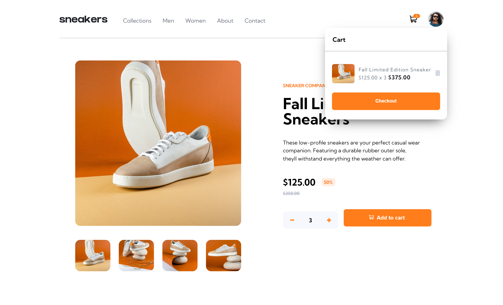
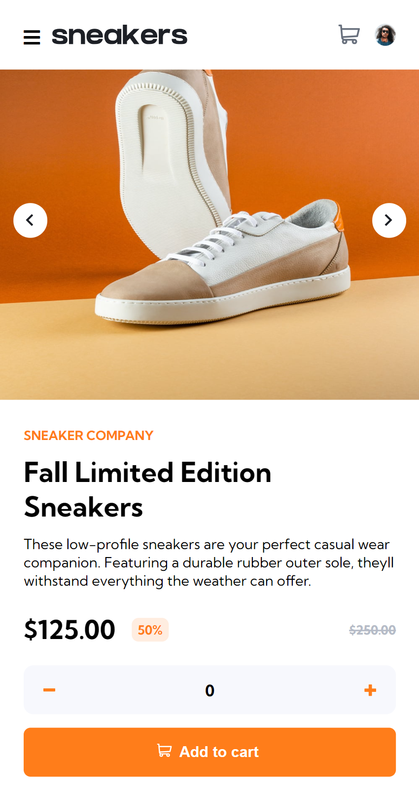

# E-commerce product page

## My Journey

I had fun building this project. It took me a week to finish, not the best when it comes to code structure and stuff but that is something I will work on the next project. My JS file even though it works is a mess, I struggled everytime I come back to the project which in the next project should be fixed - have a cleaner code.

`KeyPoints`
- Mobile first approach
- Purely JS no frameworks whatsoever
- I learned to use SVG and how to manipulate them

## Project Link
- [Project Link](https://seigfred0.github.io/project-30_eCommerceProductPage/)